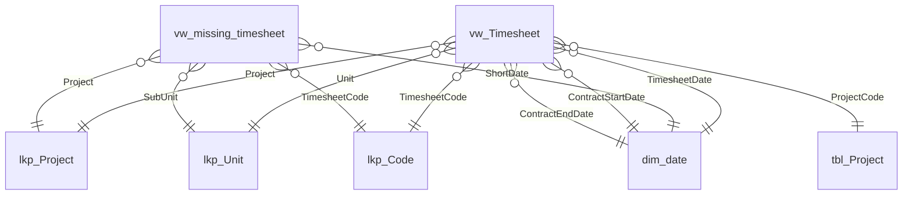

# Power BI Solution Documentation

Generated by Langchain Documentation Agent
Date: 2025-04-24 17:08:44

## Table of Contents

* [1. Overview](#1-overview)
* [2. Data Model](#2-data-model)
  * [2.1 Model Diagram](#21-model-diagram)
  * [2.2 Tables](#22-tables)
  * [2.3 Measures](#23-measures)
  * [2.4 Relationships](#24-relationships)
* [3. Visuals (Based on Configuration)](#3-visuals-based-on-configuration)

---

## 1. Overview

The Power BI solution presented is designed to analyze and visualize timesheet data, focusing on key performance metrics related to employee hours, sales amounts, and project management. The primary purpose of this solution appears to be to provide insights into project performance, employee productivity, and financial metrics, enabling stakeholders to make informed decisions based on comprehensive data analysis.

The data model includes several key components, such as the `vw_Timesheet` and `tbl_Project` tables, which contain essential information about employee hours, sales amounts, project statuses, and financial details. Key measures calculated within the model include total hours worked, cumulative sales, project margins, and realization percentages. The solution also incorporates various dimensions, such as time (via the `DimDate` table), to facilitate time-based analysis. The visualizations are structured to allow users to drill down into specific projects, employees, and time periods, providing a detailed view of performance metrics across different dimensions. Overall, this Power BI solution serves as a robust tool for tracking and optimizing project and employee performance within an organization.

## 2. Data Model

### 2.1 Model Diagram



### 2.2 Tables

#### Table: `dim_date`

### Table: dim_date

**Purpose:** The `dim_date` table serves as a date dimension, providing various attributes related to dates for analytical purposes.

**Key Columns:**
- **DateKey**: An integer representing the unique identifier for each date.
- **ShortDate**: A dateTime field representing the date in a long format.
- **DayName**: A string representing the name of the day.
- **DayNumberOfWeek**: An integer indicating the day number within the week.
- **DayNumberOfMonth**: An integer indicating the day number within the month.
- **DayNumberOfYear**: An integer indicating the day number within the year.
- **WeekNumberOfYear**: An integer indicating the week number within the year.
- **MonthName**: A string representing the name of the month.
- **MonthNumberOfYear**: An integer indicating the month number within the year.
- **CalendarQuarter**: A string representing the quarter of the year.
- **CalendarYear**: An integer indicating the year.
- **CurrentYearFlag**: An integer flag indicating if the date is in the current year.

#### Table: `lkp_Unit`

### Table: lkp_Unit

**Description:**  
The `lkp_Unit` table serves as a lookup table for organizational units, providing essential details related to each unit's structure and billable department.

**Key Columns:**
- **Organisatorische eenheid** (string): Represents the organizational unit.
- **BillableDep** (int64): Indicates the billable department associated with the unit, summarized by sum.
- **Unit** (string): Specifies the unit name.
- **OWN-Sub-ExtT** (string): Additional categorization for the unit.

**Data Source:**  
The data is imported from an Excel workbook located at a specified SharePoint URL, which contains the relevant organizational unit information.

#### Table: `tbl_project`

### Table: tbl_project

**Description:**  
The `tbl_project` table is designed to store information related to various projects, including their identifiers, descriptions, statuses, financial details, and key dates.

**Key Columns:**
- **ProjectKey** (int64): Unique identifier for each project.
- **Project** (string): Name of the project.
- **ProjectDescription** (string): Detailed description of the project.
- **ProjectGroup** (string): Group to which the project belongs.
- **ProjectGroupDescription** (string): Description of the project group.
- **Statuscode** (string): Code representing the status of the project.
- **Status** (string): Current status of the project.
- **ProjectleaderId** (string): Identifier for the project leader.
- **Administration** (string): Administrative details related to the project.
- **Currency** (string): Currency used for financial transactions.
- **TotalContractSum** (decimal): Total sum of the contract in specified currency.
- **SalesPriceBaseCurrency** (decimal): Sales price in base currency.
- **DateCreated** (dateTime): Date when the project was created.
- **Startdate** (dateTime): Start date of the project.
- **PlannedCompletionDate** (dateTime): Expected completion date of the project.

#### Table: `vw_Timesheet`

### Table: vw_Timesheet

**Description:**  
The `vw_Timesheet` table aggregates timesheet data, providing insights into employee hours, contract statuses, and project involvement. It is designed to facilitate reporting and analysis of employee time tracking and project billing.

**Key Columns:**
- **Approved_With_V_Z:** Indicates if a timesheet is approved or has a specific TimesheetCode ("V" or "Z").
- **Employee_WeeklyHours:** Concatenates employee names with their corresponding hours per week.
- **Join_Key:** A string used for joining with other tables.
- **RReady_With_V_Z:** Indicates if a report is ready based on approval or TimesheetCode.
- **Own-Sub-ExtT:** Related data from the `lkp_Unit` table.
- **ContractStatusTodayPBI:** Current contract status of the employee.
- **Index:** A unique identifier for each record.
- **IPM_ManagerName:** Name of the IPM manager associated with the employee.
- **IPMIDName:** Identifier for the IPM manager.
- **ReportingEntity:** Classifies the reporting entity based on the employer.
- **cc_Employer:** Categorizes employers into specific groups.

**Measures:**
- **HoursDifference:** Calculates the difference between total hours and maximum hours per week.
- **ContractStatusMeasure:** Determines if a contract is active based on the end date.
- **TotalHoursTracked:** Sums the total hours tracked, handling blanks appropriately.
- **TotalContractedHours:** Sums the maximum hours per week for each employee.

This table is essential for analyzing employee utilization, contract statuses, and overall project billing efficiency.

#### Table: `vw_missing_timesheet`

### Table: vw_missing_timesheet

**Description:**  
The `vw_missing_timesheet` table is designed to track and analyze missing timesheet entries for employees. It provides insights into hours worked versus contracted hours, identifies employees with negative missing hours, and calculates various metrics related to timesheet completeness.

**Key Columns:**
- `Year_`: The year of the timesheet entry.
- `Week_`: The week number of the timesheet entry.
- `ShortDate`: The date of the timesheet entry.
- `ManagerID`: The identifier for the manager associated with the employee.
- `EmployeeID`: The unique identifier for the employee.
- `EmployeeName`: The name of the employee.
- `ContractHours`: The number of hours contracted for the employee.
- `Hours_`: The actual hours worked by the employee.
- `MissingHours`: The difference between contracted hours and actual hours worked.

### 2.3 Measures

#### Measure: `ContractStatus2`

### Measure: ContractStatus2

**Purpose:**  
The `ContractStatus2` measure evaluates the status of a contract based on the calculated `ContractStatusMeasure` and the difference in hours worked.

**Calculation Logic:**  
The measure uses an `IF` statement to check if the `ContractStatusMeasure` is "Active". If it is, it returns the value of the `HoursDifference` measure. If the contract status is not "Active", it returns "Not Active".

**Formula:**  
```DAX
IF(
    [ContractStatusMeasure] = "Active",
    [HoursDifference],
    "Not Active"
)
``` 

**Format Hint:**  
The measure is formatted as a general number.

#### Measure: `ContractStatusMeasure`

### ContractStatusMeasure

**Purpose:**  
The `ContractStatusMeasure` is designed to determine the current status of a contract based on its end date.

**Calculation Logic:**  
The measure evaluates whether the maximum contract end date from the `vw_Timesheet` table is blank or greater than today's date. If either condition is true, it returns "Active"; otherwise, it returns "Not Active".

**Formula:**  
```DAX
IF(
    ISBLANK(MAX('vw_Timesheet'[ContractEndDate])) || MAX('vw_Timesheet'[ContractEndDate]) > TODAY(),
    "Active",
    "Not Active"
)
```

#### Measure: `CountNegativeMissingHours`

### Measure: CountNegativeMissingHours

**Purpose:**  
The `CountNegativeMissingHours` measure calculates the number of distinct employees who have negative missing hours recorded in the `vw_missing_timesheet` table.

**Calculation Logic:**  
The measure uses the `CALCULATE` function to modify the filter context and applies a condition to count only those employees whose `MissingHours` are less than zero. The formula is as follows:

```DAX
CountNegativeMissingHours = 
CALCULATE(
    DISTINCTCOUNT('vw_missing_timesheet'[EmployeeID]),
    'vw_missing_timesheet'[MissingHours] < 0
)
```

**Format:**  
The result is formatted as a whole number (0).

#### Measure: `Count_Negative_Consultant`

### Measure: Count_Negative_Consultant

**Purpose:**  
The `Count_Negative_Consultant` measure calculates the number of distinct consultants (employees) who have recorded negative missing hours in the `vw_missing_timesheet` table.

**Calculation Logic:**  
The measure uses the following DAX formula:

```DAX
Count_Negative_Consultant = 
CALCULATE(
    DISTINCTCOUNT('vw_missing_timesheet'[EmployeeName]),
    'vw_missing_timesheet'[MissingHours] < 0
)
```

This formula counts the unique `EmployeeName` entries where the `MissingHours` are less than zero. The result is formatted as a whole number (0).

#### Measure: `CurrentWeekCard`

### Measure: CurrentWeekCard

**Purpose:**  
The `CurrentWeekCard` measure is designed to return the current week number of the year based on the current date.

**Calculation Logic:**  
The measure is calculated using the DAX function `WEEKNUM(TODAY())`, which retrieves the week number for the current date. 

**Format:**  
The result is formatted as a general number (0).

#### Measure: `DISTINCT_COUNT_EMP`

### Measure: DISTINCT_COUNT_EMP

**Purpose:**  
The `DISTINCT_COUNT_EMP` measure calculates the distinct count of employees based on their names from the `vw_Timesheet` table.

**Calculation Logic:**  
The measure uses the `DISTINCTCOUNT` function to count unique entries in the `EmployeeName` column of the `vw_Timesheet` table.

**Formula:**  
```DAX
DISTINCT_COUNT_EMP = DISTINCTCOUNT(vw_Timesheet[EmployeeName])
```

**Format:**  
The result is formatted as a general number (0).

#### Measure: `Dax_EmpCount`

### DAX Measure: Dax_EmpCount

**Purpose:**  
The `Dax_EmpCount` measure calculates the distinct count of employees based on the `EmployeeName` field from the `vw_missing_timesheet` table.

**Calculation Logic:**  
The measure uses the `CALCULATE` function combined with `DISTINCTCOUNT` to count unique employee names. The formula is as follows:

```DAX
Dax_EmpCount = CALCULATE(DISTINCTCOUNT(vw_missing_timesheet[EmployeeName]))
```

**Format:**  
The result is formatted as a general number (0).

#### Measure: `Dax_EmpCount_Approved`

### DAX Measure: Dax_EmpCount_Approved

**Purpose:**  
The `Dax_EmpCount_Approved` measure calculates the distinct count of employees whose timesheets have not been approved.

**Calculation Logic:**  
The measure uses the `CALCULATE` function to modify the filter context and counts distinct employee names from the `vw_Timesheet` table where the `Approved` column is set to `FALSE()`. 

**Formula:**  
```DAX
Dax_EmpCount_Approved = 
CALCULATE(
    DISTINCTCOUNT(vw_Timesheet[EmployeeName]),
    vw_Timesheet[Approved] = FALSE()
)
```

**Format:**  
The result is formatted as a general number (0).

#### Measure: `Dax_EmpCount_MissingTS`

### DAX Measure: Dax_EmpCount_MissingTS

**Purpose:**  
The `Dax_EmpCount_MissingTS` measure calculates the count of active employees who have missing timesheet hours.

**Calculation Logic:**  
The measure uses the following logic:

1. **Active Employees Filtering:**  
   It filters a summarized table (`vw_missing_timesheet`) that includes:
   - Employee names
   - Year and week of the timesheet
   - Unit and subunit information
   - A calculated column for missing hours, which is the sum of hours minus the maximum contract hours.
   - A minimum active employee flag.

   The filter criteria are:
   - The minimum active employee flag must equal 1.
   - The missing hours must be less than 0.

2. **Count Rows:**  
   The measure returns the count of rows from the filtered table, representing the number of active employees with missing timesheet hours.

**Format:**  
The measure is formatted as a general number.

#### Measure: `Dax_EmpCount_RReady`

### DAX Measure: Dax_EmpCount_RReady

**Purpose:**  
The `Dax_EmpCount_RReady` measure calculates the distinct count of employees whose reports are not marked as ready.

**Calculation Logic:**  
The measure uses the `CALCULATE` function to modify the filter context and counts the distinct `EmployeeName` from the `vw_Timesheet` table where the `ReportReady` column is set to `FALSE()`.

**Formula:**  
```DAX
Dax_EmpCount_RReady = 
CALCULATE(
    DISTINCTCOUNT(vw_Timesheet[EmployeeName]),
    vw_Timesheet[ReportReady] = FALSE()
)
```

**Format String:**  
0

#### Measure: `Dax_MissingHours`

### DAX Measure: Dax_MissingHours

**Purpose:**  
The `Dax_MissingHours` measure calculates the total missing hours for active employees who have reported negative hours compared to their contracted hours.

**Calculation Logic:**  
The measure uses the following DAX formula:

```DAX
VAR ActiveEmployees = 
    FILTER(
        SUMMARIZE(
            vw_missing_timesheet,
            vw_missing_timesheet[EmployeeName],
            vw_missing_timesheet[Year_],
            vw_missing_timesheet[Week_],
            lkp_Unit[Unit],
            vw_missing_timesheet[SubUnit],
            "MissingHours", SUM(vw_missing_timesheet[Hours_]) - MAX(vw_missing_timesheet[ContractHours]),
            "MinActiveEmp", MIN(vw_missing_timesheet[CC_ActiveEmployees])
        ),
        [MinActiveEmp] = 1 && [MissingHours] < 0
    )

RETURN 
    SUMX(ActiveEmployees, [MissingHours])
```

This formula first creates a variable `ActiveEmployees` that filters a summarized table of `vw_missing_timesheet` for employees with at least one active status and negative missing hours. It then returns the sum of the missing hours for these active employees. 

**Format:**  
The measure is formatted as a general number.

#### Measure: `ExpectedContractHoursWeekly`

### Measure: ExpectedContractHoursWeekly

**Purpose:**  
The `ExpectedContractHoursWeekly` measure calculates the total expected contract hours for each employee on a weekly basis, based on the maximum contract hours recorded in the `vw_missing_timesheet` table.

**Calculation Logic:**  
The measure uses the following DAX formula:

```DAX
SUMX(
    SUMMARIZE(
        vw_missing_timesheet,
        vw_missing_timesheet[Week_],
        vw_missing_timesheet[EmployeeID],
        "ContractHours", MAX(vw_missing_timesheet[ContractHours])
    ),
    [ContractHours]
)
```

This formula summarizes the `vw_missing_timesheet` table by week and employee, retrieving the maximum contract hours for each combination. It then sums these maximum values to provide the total expected contract hours for the week. 

**Format Hint:**  
The measure is formatted as a general number.

#### Measure: `HoursDifference`

### Measure: HoursDifference

**Purpose:**  
The `HoursDifference` measure calculates the difference between the total hours recorded in the `vw_Timesheet` table and the maximum hours per week defined for employees.

**Calculation Logic:**  
The measure is defined as follows:

```DAX
HoursDifference = SUM('vw_Timesheet'[Hours]) - MAX('vw_Timesheet'[HoursperWeek])
```

This formula sums all the hours from the `Hours` column and subtracts the maximum value found in the `HoursperWeek` column. 

**Format Hint:**  
The measure is formatted as a general number.

#### Measure: `MISSING%`

### Measure: MISSING%

**Purpose:**  
The MISSING% measure calculates the percentage of employees who are missing timesheet entries compared to the total number of distinct employees.

**Calculation Logic:**  
The measure is defined as follows:

```DAX
MISSING% = DIVIDE([Dax_EmpCount] - [Dax_EmpCount_MissingTS], [Dax_EmpCount]) * 100
```

- **[Dax_EmpCount]**: This measure counts the distinct number of employees.
- **[Dax_EmpCount_MissingTS]**: This measure counts the distinct number of employees with missing timesheet entries.
- The formula subtracts the count of employees with missing timesheets from the total count of employees, divides by the total count, and multiplies by 100 to express the result as a percentage. 

**Format:**  
The measure is formatted as a general number.

#### Measure: `MSR_%_Budget_Used`

### Measure: MSR_%_Budget_Used

**Purpose:**  
The measure `MSR_%_Budget_Used` calculates the percentage of the budget that has been utilized based on the total sales amount recorded in the timesheet compared to the total budget allocated for the project.

**Calculation Logic:**  
The measure is defined as follows:

```DAX
DIVIDE(SUM(vw_Timesheet[SalesAmount]), SUM('tbl_Project'[SalesPriceBaseCurrency]), 0)
```

This formula sums the `SalesAmount` from the `vw_Timesheet` table and divides it by the total budget (`SalesPriceBaseCurrency`) from the `tbl_Project` table. If the denominator is zero, it returns 0 to avoid division errors.

**Format:**  
The result is formatted as a percentage with two decimal places.

#### Measure: `MSR_AVG_HOURLY_RATE`

### Measure: MSR_AVG_HOURLY_RATE

**Purpose:**  
The `MSR_AVG_HOURLY_RATE` measure calculates the average hourly rate based on sales amount and total hours worked.

**Calculation Logic:**  
The measure is defined as follows:

```DAX
SUM(vw_Timesheet[SalesAmount]) / SUM(vw_Timesheet[Hours])
```

This formula sums the `SalesAmount` from the `vw_Timesheet` table and divides it by the total hours worked, also sourced from the same table. 

**Format Hint:**  
The measure is annotated with a format hint indicating it is a general number.

#### Measure: `MSR_Cumulative Cost`

### Measure: MSR_Cumulative Cost

**Purpose:**  
The 'MSR_Cumulative Cost' measure calculates the cumulative total of costs incurred up to the selected month in a Power BI report.

**Calculation Logic:**  
The measure uses the following DAX formula:

```DAX
VAR SelectedMonth = MAX('DimDate'[MonthNumberOfYear])  -- Get the selected month in the visual
RETURN 
CALCULATE(
    SUM(vw_Timesheet[CostAmount]),
    FILTER(
        ALLSELECTED('DimDate'),  
        'DimDate'[MonthNumberOfYear] <= SelectedMonth  -- Include all months up to the current one
    )
)
```

This formula first determines the maximum month number selected in the visual context. It then calculates the sum of the 'CostAmount' from the 'vw_Timesheet' table, filtering the results to include only those months that are less than or equal to the selected month. 

**Format Hint:**  
The measure is formatted as a general number.

#### Measure: `MSR_Cumulative Sales`

### Measure: MSR_Cumulative Sales

**Purpose:**  
The 'MSR_Cumulative Sales' measure calculates the cumulative sales amount up to the selected month in a Power BI visual.

**Calculation Logic:**  
The measure uses the following DAX formula:

```DAX
VAR SelectedMonth = MAX('DimDate'[MonthNumberOfYear])  -- Get the selected month in the visual
RETURN 
CALCULATE(
    SUM(vw_Timesheet[SalesAmount]),
    FILTER(
        ALLSELECTED('DimDate'),  
        'DimDate'[MonthNumberOfYear] <= SelectedMonth  -- Include all months up to the current one
    )
)
```

This formula first determines the maximum month number selected in the visual. It then calculates the total sales amount from the 'vw_Timesheet' table, filtering the dates to include only those up to and including the selected month. 

**Format Hint:**  
The measure is formatted as a general number.

#### Measure: `MSR_Cumulative_Revenue`

### Measure: MSR_Cumulative_Revenue

**Purpose:**  
The `MSR_Cumulative_Revenue` measure calculates the cumulative revenue over time, allowing users to analyze total sales amounts up to the current date in the selected context.

**Calculation Logic:**  
The measure is defined using the following DAX formula:

```DAX
CALCULATE(
    SUM(vw_Timesheet[SalesAmount]),
    FILTER(
        ALLSELECTED(DimDate[ShortDate]),
        DimDate[ShortDate] <= MAX(DimDate[ShortDate])
    )
)
```

This formula sums the `SalesAmount` from the `vw_Timesheet` table while filtering the dates to include only those that are less than or equal to the maximum date in the current context. The use of `ALLSELECTED` ensures that the calculation respects any filters applied in the report while still allowing for cumulative aggregation.

#### Measure: `MSR_PROJECT_%_REALIZATION`

### Measure: MSR_PROJECT_%_REALIZATION

**Purpose:**  
The `MSR_PROJECT_%_REALIZATION` measure calculates the percentage of project realization based on the sales amount relative to the total sales price in the base currency for the project.

**Calculation Logic:**  
The measure is defined as follows:

```DAX
IF(sum(tbl_Project[SalesPriceBaseCurrency]) <> 0, 
   sum(vw_Timesheet[SalesAmount]) / sum(tbl_Project[SalesPriceBaseCurrency]))
```

This formula checks if the total sales price in the base currency is not zero. If true, it divides the total sales amount from the timesheet by the total sales price in the base currency, yielding the percentage realization of the project. 

**Format:**  
The result is formatted as a percentage with two decimal places.

#### Measure: `MSR_ProjectMargin`

### MSR_ProjectMargin

**Purpose:**  
The `MSR_ProjectMargin` measure calculates the profit margin for projects by determining the difference between total sales and total costs.

**Calculation Logic:**  
The measure is defined as follows:

```DAX
MSR_ProjectMargin = SUM(vw_Timesheet[SalesAmount]) - SUM(vw_Timesheet[CostAmount])
```

This formula sums the `SalesAmount` and subtracts the sum of `CostAmount` from it, providing the overall project margin. 

**Format Hint:**  
The measure is formatted as a general number.

#### Measure: `MissingHoursOut`

### Measure: MissingHoursOut

**Purpose:**  
The `MissingHoursOut` measure calculates the difference between the maximum contracted hours and the maximum hours worked for employees, indicating the total missing hours.

**Calculation Logic:**  
The measure is defined as follows:

```DAX
MissingHoursOut = MAX(vw_missing_timesheet[ContractHours]) - MAX(vw_missing_timesheet[Hours_])
```

This formula retrieves the maximum value of `ContractHours` and subtracts the maximum value of `Hours_` from it. The result represents the total hours that are missing based on the contracted hours versus the actual hours recorded. 

**Format Hint:**  
The measure is formatted as a general number.

#### Measure: `Msr_ActiveContacts`

### Measure: Msr_ActiveContacts

**Purpose:**  
The `Msr_ActiveContacts` measure calculates the number of active contacts (employees) based on their contract dates within a specified date range.

**Calculation Logic:**  
The measure uses the following logic:

1. **Variables:**
   - `_MaxDate`: Retrieves the maximum date from the `DimDate[ShortDate]`.
   - `_MinDate`: Retrieves the minimum date from the `DimDate[ShortDate]`.
   - `_StartsBeforeMonthEnd`: Creates a table of unique `EmployeeID`s where the `ShortDate` is less than or equal to `_MaxDate`.
   - `_notEndAfterMonthEnd`: Creates a table of unique `EmployeeID`s where the `ShortDate` is greater than or equal to `_MinDate` or is blank, utilizing the relationship between `DimDate[ShortDate]` and `vw_Timesheet[ContractEndDate]`.

2. **Return Value:**  
The measure returns the count of rows that are present in both `_notEndAfterMonthEnd` and `_StartsBeforeMonthEnd`, indicating the number of active contacts. 

The formula for the measure is as follows:
```DAX
VAR _MaxDate = MAX(DimDate[ShortDate])
VAR _MinDate = MIN(DimDate[ShortDate])
VAR _StartsBeforeMonthEnd = CALCULATETABLE(VALUES(vw_Timesheet[EmployeeID]), DimDate[ShortDate] <= _MaxDate)
VAR _notEndAfterMonthEnd = CALCULATETABLE(
    VALUES(vw_Timesheet[EmployeeID]),
    DimDate[ShortDate] >= _MinDate || ISBLANK(DimDate[ShortDate]),
    USERELATIONSHIP(DimDate[ShortDate], vw_Timesheet[ContractEndDate])
)
RETURN COUNTROWS(INTERSECT(_notEndAfterMonthEnd, _StartsBeforeMonthEnd))
```

#### Measure: `Msr_Budget`

### Measure: Msr_Budget

**Purpose:**  
The `Msr_Budget` measure calculates the current budget value based on the selected week, dynamically retrieving the most recent available budget if the current budget is not available.

**Calculation Logic:**  
1. It retrieves the current week number using `SELECTEDVALUE(DimDate[WeekNumberOfYear])`.
2. It calculates the previous budget value by filtering the `Msr_SalesPriceBaseCurrency` measure for weeks less than the current week.
3. The measure returns the current budget value if it is not blank; otherwise, it returns the previous budget value.

**Formula:**
```DAX
VAR CurrentWeek = SELECTEDVALUE(DimDate[WeekNumberOfYear])
VAR PrevBudget = 
    CALCULATE(
        [Msr_SalesPriceBaseCurrency],
        FILTER(
            ALLSELECTED(DimDate),  
            DimDate[WeekNumberOfYear] < CurrentWeek
        )
    )
RETURN
    IF(
        NOT(ISBLANK([Msr_SalesPriceBaseCurrency])),
        [Msr_SalesPriceBaseCurrency],
        PrevBudget
    )
```

**Format:**  
"€"\ #,0.00;-"€"\ #,0.00;"€"\ #,0.00

#### Measure: `Msr_HoursPercentage`

### Msr_HoursPercentage

**Purpose:**  
The `Msr_HoursPercentage` measure calculates the percentage of hours worked by an employee or group of employees relative to the total hours worked across selected categories, projects, or employees.

**Calculation Logic:**  
The measure is defined as follows:

```DAX
VAR TotalValue = 
    CALCULATE(SUM(vw_Timesheet[Hours]), 
        ALLSELECTED(vw_Timesheet[GroupCat], vw_Timesheet[Project], vw_Timesheet[EmployeeName])
    )
RETURN 
    DIVIDE(SUM(vw_Timesheet[Hours]), TotalValue, 0)
```

This formula first computes the total hours worked (`TotalValue`) across all selected categories, projects, and employee names. It then divides the sum of hours for the current context by this total, returning a percentage. If the total value is zero, it returns zero to avoid division errors. 

**Format:**  
The result is formatted as a percentage with two decimal places (0.00%;-0.00%;0.00%).

#### Measure: `Msr_SalesPriceBaseCurrency`

### Measure: Msr_SalesPriceBaseCurrency

**Purpose:**  
The `Msr_SalesPriceBaseCurrency` measure calculates the total sales price in the base currency for each project and client combination.

**Calculation Logic:**  
The measure uses the `SUMX` function to iterate over a summarized table created by `SUMMARIZE`, which groups the data by `ProjectProfile` and `Client`. For each group, it retrieves the selected sales price from the `tbl_Project[SalesPriceBaseCurrency]` using `SELECTEDVALUE`. The final result is the sum of these selected values across all groups.

**Formula:**
```DAX
SUMX(
    SUMMARIZE(
        vw_Timesheet, 
        vw_Timesheet[ProjectProfile], 
        vw_Timesheet[Client], 
        "MeasureValue", SELECTEDVALUE(tbl_Project[SalesPriceBaseCurrency])
    ), 
    [MeasureValue]
)
```

**Format:**  
The measure is formatted as currency with the following format string: `\$#,0.###############;(\$#,0.###############);\$#,0.###############`.

**Currency Culture:**  
The measure uses the currency culture setting for `en-US`.

#### Measure: `PercentageCompleteness`

### Measure: PercentageCompleteness

**Purpose:**  
The `PercentageCompleteness` measure calculates the completeness percentage of missing hours relative to the expected contracted hours for a given period.

**Calculation Logic:**  
The measure is defined as follows:

```DAX
DIVIDE(
    SUM(vw_missing_timesheet[MissingHours]) - [ExpectedContractHoursWeekly],
    [ExpectedContractHoursWeekly],
    0
)
```

This formula computes the difference between the total missing hours and the expected contracted hours for the week, then divides that difference by the expected contracted hours to yield a completeness percentage. If the expected contracted hours are zero, it returns zero to avoid division by zero errors.

#### Measure: `Static Total Employees`

### Measure: 'Static Total Employees'

**Purpose:**  
The 'Static Total Employees' measure calculates the total number of distinct employees whose contract status is currently valid.

**Calculation Logic:**  
The measure uses the `CALCULATE` function to count distinct employee names from the `vw_Timesheet` table while applying the following filters:
- It removes all filters from the `vw_Timesheet` table using `ALL(vw_Timesheet)`.
- It includes only those records where the `ContractStatusToday` is "Valid".

**DAX Formula:**
```DAX
CALCULATE(
    DISTINCTCOUNT(vw_Timesheet[EmployeeName]), 
    ALL(vw_Timesheet),
    vw_Timesheet[ContractStatusToday] = "Valid"
)
```

**Format:**  
The measure is formatted as a general number (0).

#### Measure: `TotalActualHours`

### Measure: TotalActualHours

**Purpose:**  
The `TotalActualHours` measure calculates the total number of hours recorded in the `vw_Timesheet` table.

**Calculation Logic:**  
The measure is defined using the following DAX formula:

```DAX
SUM(vw_Timesheet[Hours])
```

This formula sums up all the values in the `Hours` column of the `vw_Timesheet` table.

**Format Hint:**  
The measure is formatted as a general number.

#### Measure: `TotalContractedHours`

### Measure: TotalContractedHours

**Purpose:**  
The `TotalContractedHours` measure calculates the total contracted hours for employees based on their maximum hours per week.

**Calculation Logic:**  
The measure uses the `SUMX` function to iterate over distinct employee names in the `vw_Timesheet` table, summing the maximum hours per week for each employee. The formula is as follows:

```DAX
SUMX(
    VALUES(vw_Timesheet[EmployeeName]),
    MAX(vw_Timesheet[HoursPerWeek])
)
```

**Format:**  
The result is formatted as a general number.

#### Measure: `TotalHoursDeltaComplete`

### Measure: TotalHoursDeltaComplete

**Purpose:**  
The `TotalHoursDeltaComplete` measure calculates the ratio of actual hours worked to contracted hours, providing insight into the completion status of hours relative to what was contracted.

**Calculation Logic:**  
The measure is defined using the following DAX formula:

```DAX
TotalHoursDeltaComplete =
    DIVIDE(
        [TotalActualHours],
        [TotalContractedHours],
        0
    )
```

This formula divides the total actual hours (`TotalActualHours`) by the total contracted hours (`TotalContractedHours`). If the denominator is zero, it returns 0 to avoid division errors.

**Format:**  
The result is formatted as a percentage with two decimal places, represented as `0.00%;-0.00%;0.00%`.

#### Measure: `TotalHoursDeltaCompleteNr`

### Measure: TotalHoursDeltaCompleteNr

**Purpose:**  
The `TotalHoursDeltaCompleteNr` measure calculates the difference between the total actual hours worked and the total contracted hours.

**Calculation Logic:**  
The measure is defined by the formula:
```DAX
[TotalActualHours] - [TotalContractedHours]
```
This formula subtracts the total contracted hours from the total actual hours, providing a numeric representation of the difference. 

**Format Hint:**  
The measure is formatted as a general number.

#### Measure: `TotalHoursTracked`

### Measure: TotalHoursTracked

**Purpose:**  
The `TotalHoursTracked` measure calculates the total hours tracked from the `vw_Timesheet` table. It ensures that if there are no hours recorded, the measure returns zero instead of a blank value.

**Calculation Logic:**  
The measure is defined as follows:

```DAX
IF (
    ISBLANK(SUM(vw_Timesheet[Hours])),
    0,
    SUM(vw_Timesheet[Hours])
)
```

This formula checks if the sum of hours is blank. If it is, the measure returns 0; otherwise, it returns the total sum of hours tracked. 

**Format Hint:**  
The measure is formatted as a general number.

#### Measure: `TotalHoursTrackedMissing`

### Measure: TotalHoursTrackedMissing

**Purpose:**  
The `TotalHoursTrackedMissing` measure is designed to evaluate the total hours tracked in the `vw_Timesheet` table. It specifically checks if the sum of hours is blank and returns a corresponding message.

**Calculation Logic:**  
The measure uses the following DAX formula:

```DAX
IF (
    ISBLANK(SUM(vw_Timesheet[Hours])),
    "Empty",
    SUM(vw_Timesheet[Hours])
)
```

This formula checks if the sum of the `Hours` column in the `vw_Timesheet` table is blank. If it is blank, the measure returns the string "Empty"; otherwise, it returns the total sum of hours tracked. 

**Format Hint:**  
The measure is formatted as a general number.

#### Measure: `UTILIZATION_New`

### DAX Measure: UTILIZATION_New

**Purpose:**  
The `UTILIZATION_New` measure calculates the ratio of billable hours to total hours for active employees, providing insight into employee utilization rates.

**Calculation Logic:**  
The measure uses the following logic:
1. It retrieves the total billable hours from the `UTI_TotalBillableHours` measure.
2. It retrieves the total hours from the `UTI_TOTALHOURS` measure.
3. It checks if there are active contacts (employees) and if the total hours are not blank.
4. If the conditions are met, it calculates the ratio of total billable hours to total hours. If the division results in a blank, it returns 0.

**Formula:**
```DAX
VAR _TotalBillableHours = [UTI_TotalBillableHours]
VAR _TotalHours = [UTI_TOTALHOURS]

RETURN
    IF(NOT(ISBLANK([Msr_ActiveContacts])), 
        IF(NOT(ISBLANK([UTI_TOTALHOURS])), 
            IF(ISBLANK(DIVIDE(_TotalBillableHours, _TotalHours)), 0, DIVIDE(_TotalBillableHours, _TotalHours))
        )
    )
```

**Format:**  
0.00%;-0.00%;0.00%

#### Measure: `UTI_TOTALHOURS`

### Measure: UTI_TOTALHOURS

**Purpose:**  
The UTI_TOTALHOURS measure calculates the total hours worked by employees on projects that qualify for tracking.

**Calculation Logic:**  
The measure uses the `CALCULATE` function to sum the hours from the `vw_Timesheet` table, applying a filter to include only those records where the `QualifyPrj` column is equal to 1.

**Formula:**  
```DAX
UTI_TOTALHOURS = CALCULATE(SUM(vw_Timesheet[Hours]), vw_Timesheet[QualifyPrj] = 1)
```

**Format Hint:**  
This measure is formatted as a general number.

#### Measure: `UTI_TotalBillableHours`

### Measure: UTI_TotalBillableHours

**Purpose:**  
The `UTI_TotalBillableHours` measure calculates the total billable hours for projects that qualify as billable or are associated with "Customer Success Services."

**Calculation Logic:**  
The measure uses the following DAX formula:

```DAX
Var FilteredHours =
    Filter(
        vw_Timesheet,
        (
        vw_Timesheet[QualifyPrj] = 1 && 
        vw_Timesheet[BillablePrj] = 1) ||
            SEARCH("Customer Success Services", vw_Timesheet[Project], 1, 0) > 0
    )
RETURN 
    SUMX(FilteredHours, vw_Timesheet[Hours])
```

This formula filters the `vw_Timesheet` table to include only those entries where the project qualifies as billable or is related to "Customer Success Services," and then sums the hours for those filtered entries. 

**Format:**  
The result is formatted as a general number (0).

#### Measure: `UniqueEmployeesPerUnit`

### UniqueEmployeesPerUnit

**Purpose:**  
The `UniqueEmployeesPerUnit` measure calculates the number of unique employees associated with each unit, based on their incomplete status.

**Calculation Logic:**  
The measure uses the `SUMX` function to iterate over a summarized table created from `vw_missing_timesheet`. It groups the data by `Week_`, `EmployeeName`, and `MAIN_UNIT`, while also determining the maximum value of the `IncompleteFlag`. The final result is the sum of the `IncompleteFlag` values, which indicates the count of unique employees per unit.

**DAX Formula:**
```DAX
SUMX(
    SUMMARIZE(
        vw_missing_timesheet,
        vw_missing_timesheet[Week_],
        vw_missing_timesheet[EmployeeName],
        vw_missing_timesheet[MAIN_UNIT],
        "IncompleteFlag", MAX(vw_missing_timesheet[IncompleteFlag])
    ),
    [IncompleteFlag]
)
```

**Format:**  
The measure is formatted as a general number (0).

#### Measure: `trackedDiff`

### Measure: trackedDiff

**Purpose:**  
The `trackedDiff` measure calculates the difference between the total hours tracked and the maximum hours per week for each employee, providing insight into discrepancies in time tracking.

**Calculation Logic:**  
The measure is defined as follows:

```DAX
[TotalHoursTracked] - 
    CALCULATE(
        MAXX(DISTINCT(vw_Timesheet[HoursPerWeek]), vw_Timesheet[HoursPerWeek]),
        ALLEXCEPT(vw_Timesheet, vw_Timesheet[EmployeeID])
    )
```

- It subtracts the maximum hours per week (considering distinct values) from the total hours tracked for each employee, while maintaining the context of the employee ID.

#### Measure: `trackedDiff2`

### Measure: trackedDiff2

**Purpose:**  
The `trackedDiff2` measure calculates the difference between the total hours tracked and the maximum hours per week for each employee, while removing filters on the `HoursPerWeek` column.

**Calculation Logic:**  
The measure is defined as follows:

```DAX
[TotalHoursTracked] - 
    CALCULATE(
        MAXX(
            DISTINCT(vw_Timesheet[HoursPerWeek]), 
            vw_Timesheet[HoursPerWeek]
        ),
        REMOVEFILTERS(vw_Timesheet[HoursPerWeek]),
        ALLEXCEPT(vw_Timesheet, vw_Timesheet[EmployeeID])
    )
```

This formula computes the total hours tracked and subtracts the maximum distinct hours per week for the employee, ensuring that any filters on `HoursPerWeek` are ignored while maintaining the context of the specific employee.

### 2.4 Relationships

The following relationships were identified:

* vw_Timesheet.Project -> lkp_Project.Project
* Cardinality: Many-to-One
* Active: True  
vw_Timesheet.Unit -> lkp_Unit.'Organisatorische eenheid'
* Cardinality: Many-to-One
* Active: True  
vw_Timesheet.TimesheetCode -> lkp_Code.Code
* Cardinality: Many-to-One
* Active: True  
vw_Timesheet.TimesheetDate -> DimDate.ShortDate
* Cardinality: Many-to-One
* Active: True  
vw_missing_timesheet.ShortDate -> DimDate.ShortDate
* Cardinality: Many-to-One
* Active: True  
vw_missing_timesheet.TimesheetCode -> lkp_Code.Code
* Cardinality: Many-to-One
* Active: True  
vw_missing_timesheet.SubUnit -> lkp_Unit.'Organisatorische eenheid'
* Cardinality: Many-to-One
* Active: True  
vw_missing_timesheet.Project -> lkp_Project.Project
* Cardinality: Many-to-One
* Active: True  
vw_Timesheet.ContractStartDate -> DimDate.ShortDate
* Cardinality: Many-to-One
* Active: False  
vw_Timesheet.ContractEndDate -> DimDate.ShortDate
* Cardinality: Many-to-One
* Active: False  
vw_Timesheet.ProjectCode -> tbl_Project.Project
* Cardinality: Many-to-One
* Active: True

## 3. Visuals (Based on Configuration)

### Visual Identifier: `Report`
(Source Path Hint: `C:/Users/Devoteam/Desktop/MY AI/2.0_MyLangAgent/Input Folder/Cust+Proj/Report`)

The visual is part of the "Devoteam Look" report, created from the cloud. It utilizes a custom theme named "Devotheme26253733243456856.json" and a base theme "CY24SU10". 

Key elements include:
- **Visual Type**: Not explicitly stated in the JSON context.
- **Main Data Fields**: Involves relationships between "vw_missing_timesheet", "onedrive_unit", and "onedrive_project".
- **Filters**: Default drill filter settings are enabled, and the filter pane is visible in edit mode.
- **Key Settings**: Enhanced tooltips are enabled, and the query limit option is set to 6. 

The layout is optimized for vertical alignment at the top, and the outspace pane is not expanded or visible.

### Visual Identifier: `000_Customer Analysis`
(Source Path Hint: `C:/Users/Devoteam/Desktop/MY AI/2.0_MyLangAgent/Input Folder/Cust+Proj/Report/sections/000_Customer Analysis`)

The visual in the specified context is configured with the following details:

- **Visual Type**: Not explicitly mentioned in the provided JSON.
- **Main Data Fields**: 
  - `tbl_Project.ProjectGroupDescription`
  - `vw_Timesheet.Project`
  - `vw_Timesheet.Own-Sub-ExtT`
  - `vw_Timesheet.EmployeeName`
- **Filters**: 
  - The visual includes a hierarchy with toggled states for "Time material" and "Fixed price".
- **Key Settings**: 
  - Vertical alignment set to 'Top'.
  - Filter pane is visible in edit mode.
  - Enhanced tooltips are enabled.
  - Default drill filter for other visuals is set to true. 

The visual utilizes a custom theme named "Devotheme26253733243456856.json" and a base theme "CY24SU10".

### Visual Identifier: `00000_Unit`
(Source Path Hint: `C:/Users/Devoteam/Desktop/MY AI/2.0_MyLangAgent/Input Folder/Cust+Proj/Report/sections/000_Customer Analysis/visualContainers/00000_Unit`)

The visual is an image visual with the following characteristics:

- **Visual Type**: Image
- **Main Data Fields**: The visual references an image resource named "Devoteam_rgb_group8358853173377017.jpg".
- **Filters**: The visual includes a dropdown filter for the "Unit" field from the "vw_Timesheet.MAIN_UNIT" query.
- **Key Settings**:
  - Image scaling type is set to "Fit".
  - The border is shown with a radius of 5 and a color of "#B4C0D2".
  - Drop shadow is disabled.
  - The header is hidden, and the background color is set to "#3C6E71". 
  - The font family for items is set to "Segoe UI" with a text size of 9D. 
  - Single selection is disabled, but a "Select All" checkbox is enabled.

### Visual Identifier: `01000_TimeSpan`
(Source Path Hint: `C:/Users/Devoteam/Desktop/MY AI/2.0_MyLangAgent/Input Folder/Cust+Proj/Report/sections/000_Customer Analysis/visualContainers/01000_TimeSpan`)

**Visual Type:** Dropdown

**Main Data Fields:**
- ProjectGroupDescription from tbl_Project
- Project from vw_Timesheet
- Own-Sub-ExtT from vw_Timesheet
- EmployeeName from vw_Timesheet

**Filters:**
- Time material
- Fixed price

**Key Settings:**
- Header: Hidden, with a background color of #3C6E71.
- Font: Segoe UI, with text sizes of 9D for items and 10D for numeric input.
- Selection: Allows multiple selections with a "Select All" checkbox enabled.
- Labels: Displayed, with units set to 1000D.
- Legend: Shown, with font size 9D and no title.
- Axis Titles: Not shown for both category and value axes.
- Data Point Color: #6198CC for SalesAmount.

### Visual Identifier: `02000_Year`
(Source Path Hint: `C:/Users/Devoteam/Desktop/MY AI/2.0_MyLangAgent/Input Folder/Cust+Proj/Report/sections/000_Customer Analysis/visualContainers/02000_Year`)

**Visual Type:** Line Chart

**Main Data Fields:** 
- Values: Sum(vw_Timesheet.SalesAmount)
- Category: vw_Timesheet.MAIN_UNIT

**Filters:** 
- Default drill filter for other visuals is enabled.

**Key Settings:**
- Legend is shown but without a title, font size set to 9D.
- Labels are displayed with units set to thousands (1000D).
- Line styles include a stroke width of 2D, markers are shown with a size of 3D.
- Data points are filled with the color #6198CC.
- Header is hidden, and the background color is #3C6E71.
- Dropdown mode is used for data selection, with a select all checkbox enabled.

### Visual Identifier: `03000_Client`
(Source Path Hint: `C:/Users/Devoteam/Desktop/MY AI/2.0_MyLangAgent/Input Folder/Cust+Proj/Report/sections/000_Customer Analysis/visualContainers/03000_Client`)

The visual is a dropdown filter. 

**Main Data Field:**
- ClientName from the table `tbl_Project`.

**Key Settings:**
- Self-filtering is enabled.
- Select all checkbox is enabled.
- Single select is disabled.
- Header is hidden.
- Background color is set to a theme color.
- Font is set to "Segoe UI" with a text size of "9D". 

**Filters:**
- The visual allows for filtering based on the ClientName field.

### Visual Identifier: `04000_Company`
(Source Path Hint: `C:/Users/Devoteam/Desktop/MY AI/2.0_MyLangAgent/Input Folder/Cust+Proj/Report/sections/000_Customer Analysis/visualContainers/04000_Company`)

The visual is a dropdown selection type. It utilizes the "vw_Timesheet.MAIN_UNIT" as the main data field. Key settings include:

- **Display Mode**: Dropdown
- **Font Family**: Segoe UI
- **Text Size**: 9D for items, 10D for numeric input
- **Single Select**: Disabled
- **Select All Checkbox**: Enabled
- **Header Background Color**: #3C6E71
- **Include Today in Date Range**: False

The visual is part of a report with a custom theme named "Devotheme26253733243456856.json" and is configured to allow changes in filter types.

### Visual Identifier: `05000_Employee`
(Source Path Hint: `C:/Users/Devoteam/Desktop/MY AI/2.0_MyLangAgent/Input Folder/Cust+Proj/Report/sections/000_Customer Analysis/visualContainers/05000_Employee`)

The visual is a dropdown filter type. It utilizes the following main data fields: `tbl_Project.ProjectGroupDescription`, `vw_Timesheet.Project`, `vw_Timesheet.Own-Sub-ExtT`, and `vw_Timesheet.EmployeeName`. 

Key settings include:
- Single select is disabled, allowing multiple selections.
- A "Select All" checkbox is enabled.
- The header is hidden, with a background color of `#3C6E71`.
- Font family is set to "Segoe UI" with varying text sizes (9D for items and 10D for numeric input).

The visual is configured to allow drill filtering on other visuals and uses enhanced tooltips. The filter pane is visible in edit mode.

### Visual Identifier: `06000_pivotTable (8a02e)`
(Source Path Hint: `C:/Users/Devoteam/Desktop/MY AI/2.0_MyLangAgent/Input Folder/Cust+Proj/Report/sections/000_Customer Analysis/visualContainers/06000_pivotTable (8a02e)`)

The visual is a **pivot table**. It includes the following main data fields:

- **Values**:
  - Sum of Hours (`Sum(vw_Timesheet.Hours)`)
  - Sum of Sales Amount (`Sum(vw_Timesheet.SalesAmount)`)
  - Average Hourly Rate (`vw_Timesheet.MSR_AVG_HOURLY_RATE`)

- **Rows**:
  - Client Name (`tbl_Project.ClientName`)
  - Project (`vw_Timesheet.Project`)
  - Own-Sub-ExtT (`vw_Timesheet.Own-Sub-ExtT`)
  - Employee Name (`vw_Timesheet.EmployeeName`)

- **Columns**:
  - Calendar Year (`DimDate.CalendarYear`)
  - Week Number of Year (`DimDate.WeekNumberOfYear`)

Key settings include:
- Active filter options for drill-down.
- The visual is positioned at coordinates (x: 9.43, y: 136.10) with a width of 595.09 and height of 575.65. 
- The filter pane is visible in edit mode.

### Visual Identifier: `07000_Project Name`
(Source Path Hint: `C:/Users/Devoteam/Desktop/MY AI/2.0_MyLangAgent/Input Folder/Cust+Proj/Report/sections/000_Customer Analysis/visualContainers/07000_Project Name`)

The visual is a dropdown filter type, utilizing the "tbl_Project.ProjectGroupDescription" and "vw_Timesheet" fields for filtering. It features a custom theme ("Devotheme26253733243456856.json") and a base theme ("CY24SU10"). 

Key settings include:
- Selection mode: Multi-select enabled with a "Select All" checkbox.
- Header: Hidden with a background color of '#3C6E71'.
- Font: Segoe UI with varying text sizes (9D for items, 10D for numeric input).
- Date range: Excludes today.

The visual is designed to allow users to filter by project groups and project types, with options for toggling between "Time material" and "Fixed price".

### Visual Identifier: `08000_Sub-Own-Ext`
(Source Path Hint: `C:/Users/Devoteam/Desktop/MY AI/2.0_MyLangAgent/Input Folder/Cust+Proj/Report/sections/000_Customer Analysis/visualContainers/08000_Sub-Own-Ext`)

The visual is a dropdown selection type. It utilizes the following main data fields: `vw_Timesheet.MAIN_UNIT`, `tbl_Project.ProjectGroupDescription`, `vw_Timesheet.Project`, `vw_Timesheet.Own-Sub-ExtT`, and `vw_Timesheet.EmployeeName`. 

Key settings include:
- The header is hidden and has a background color of `#3C6E71`.
- Font family is set to `Segoe UI` with a text size of `9D` for items and `10D` for numeric input.
- Selection allows multiple selections with a "select all" checkbox enabled.
- The dropdown mode is enabled, and inverted selection mode is active.
- The date range does not include today.

The visual is pinned for specific levels and has a collapsed structure for some fields.

### Visual Identifier: `09000_Project Type`
(Source Path Hint: `C:/Users/Devoteam/Desktop/MY AI/2.0_MyLangAgent/Input Folder/Cust+Proj/Report/sections/000_Customer Analysis/visualContainers/09000_Project Type`)

The visual is a dropdown type (ID: 2048) configured to display the "DevoteamPillar" field from the "tbl_Project" entity. It allows multiple selections with a "select all" checkbox enabled. The header is hidden, and the background color is set to '#3C6E71'. The font used is 'Segoe UI' with a text size of 9D for items and 10D for numeric inputs. The visual supports enhanced tooltips and has a default drill filter for other visuals. The vertical alignment is set to 'Top', and the filter pane is visible in edit mode.

### Visual Identifier: `10000_Revenue%2FWeek`
(Source Path Hint: `C:/Users/Devoteam/Desktop/MY AI/2.0_MyLangAgent/Input Folder/Cust+Proj/Report/sections/000_Customer Analysis/visualContainers/10000_Revenue%2FWeek`)

**Visual Type:** Line Chart

**Main Data Fields:** 
- Sales Amount from `vw_Timesheet`

**Filters:** 
- Project Group Description from `tbl_Project`
- Project from `vw_Timesheet`
- Own-Sub-ExtT from `vw_Timesheet`
- Employee Name from `vw_Timesheet`

**Key Settings:**
- Legend is shown with a font size of 9.
- Axis titles are hidden for both category and value axes.
- Data labels are displayed in thousands (1000D) and positioned automatically.
- Line style has a stroke width of 2, markers are shown with a size of 3, and borders are visible.
- Data points are filled with the color `#6198CC`.

### Visual Identifier: `11000_pivotTable (48569)`
(Source Path Hint: `C:/Users/Devoteam/Desktop/MY AI/2.0_MyLangAgent/Input Folder/Cust+Proj/Report/sections/000_Customer Analysis/visualContainers/11000_pivotTable (48569)`)

The visual is a **pivot table**. 

**Main Data Fields:**
- **Rows:** 
  - DimDate.CalendarYear
  - vw_Timesheet.MAIN_UNIT
  - vw_Timesheet.Unit
  - vw_Timesheet.EmployeeName
- **Columns:** 
  - DimDate.WeekNumberOfYear
- **Values:** 
  - Sum(vw_Timesheet.SalesAmount)

**Key Settings:**
- The visual is positioned at (x: 610.998, y: 443.666) with a width of 658.134 and height of 268.085.
- The active section index is 0.
- The filter pane is visible in edit mode.
- Enhanced tooltips are enabled.

### Visual Identifier: `12000_SubUnit`
(Source Path Hint: `C:/Users/Devoteam/Desktop/MY AI/2.0_MyLangAgent/Input Folder/Cust+Proj/Report/sections/000_Customer Analysis/visualContainers/12000_SubUnit`)

The visual is a dropdown filter. It utilizes the "vw_Timesheet.Unit" field as its main data field, displaying "SubUnit". 

Key settings include:
- The header is hidden.
- The background color is set to a solid color (#3C6E71).
- Font family is "Segoe UI" with a text size of 9D.
- Selection allows multiple selections with a "Select All" checkbox enabled.
- The dropdown mode is enabled.

Filters are applied based on the "vw_Timesheet" entity, specifically for "Unit".

### Visual Identifier: `13000_image (6f358)`
(Source Path Hint: `C:/Users/Devoteam/Desktop/MY AI/2.0_MyLangAgent/Input Folder/Cust+Proj/Report/sections/000_Customer Analysis/visualContainers/13000_image (6f358)`)

The visual is an **image** type. It displays an image sourced from the resource package, specifically "Devoteam_rgb_group8358853173377017.jpg". The image scaling is set to **Fit**. 

Key settings include:
- **Border**: Enabled with a radius of **5D** and a color of **#B4C0D2**.
- **Drop Shadow**: Disabled.
- **Visual Link**: Disabled.

The visual is positioned at coordinates (4.12, 0) with a width of approximately **59.51** and a height of approximately **58.92**.

### Visual Identifier: `14000_actionButton (88e87)`
(Source Path Hint: `C:/Users/Devoteam/Desktop/MY AI/2.0_MyLangAgent/Input Folder/Cust+Proj/Report/sections/000_Customer Analysis/visualContainers/14000_actionButton (88e87)`)

The visual is an **action button** designed to reset slicers. 

**Key Settings:**
- **Text:** "Reset Slicers"
- **Font Family:** Segoe UI
- **Font Size:** 10D
- **Horizontal Alignment:** Right
- **Vertical Alignment:** Middle
- **Icon Shape Type:** Reset
- **Icon Line Weight:** 2L
- **Icon Line Color:** #ffffff
- **Tile Shape:** Rectangle
- **Background Color:** #3C6E71 (header background hidden)

**Main Data Fields:**
- **Query Reference:** vw_Timesheet.MAIN_UNIT

**Filters:**
- **Drill Filter Other Visuals:** Enabled

**Selection Settings:**
- **Single Select:** False
- **Select All Checkbox Enabled:** True

The visual is positioned at coordinates (1153.36, 60.32) with a width of 120.64 and height of 37.40.

### Visual Identifier: `001_Project Details`
(Source Path Hint: `C:/Users/Devoteam/Desktop/MY AI/2.0_MyLangAgent/Input Folder/Cust+Proj/Report/sections/001_Project Details`)

The visual is a hierarchical structure with multiple levels, primarily focused on project details. 

**Visual Type:** Not explicitly stated, but likely a hierarchical or tree visual based on the context.

**Main Data Fields:**
- `tbl_Project.ProjectGroupDescription`
- `vw_Timesheet.Project`
- `vw_Timesheet.Own-Sub-ExtT`
- `vw_Timesheet.EmployeeName`

**Filters:**
- The visual includes toggled identity values for project types: "Time material" and "Fixed price".

**Key Settings:**
- The visual is pinned for easy access.
- The filter pane is visible in edit mode.
- Enhanced tooltips are enabled.
- The layout is set to vertical alignment at the top.

### Visual Identifier: `00000_Pillar`
(Source Path Hint: `C:/Users/Devoteam/Desktop/MY AI/2.0_MyLangAgent/Input Folder/Cust+Proj/Report/sections/001_Project Details/visualContainers/00000_Pillar`)

**Visual Type:** Slicer

**Main Data Field:** DevoteamPillar from tbl_Project

**Filters:** 
- ProjectGroupDescription
- Project
- Own-Sub-ExtT
- EmployeeName

**Key Settings:**
- Display mode: Dropdown
- Inverted selection mode: Enabled
- Single select: Disabled
- Select all checkbox: Enabled
- Header: Hidden with a background color of #3C6E71
- Font: Segoe UI, size 9D for items and 10D for numeric input
- Vertical alignment: Top
- Drill filter other visuals: Enabled

### Visual Identifier: `01000_TimeSpan`
(Source Path Hint: `C:/Users/Devoteam/Desktop/MY AI/2.0_MyLangAgent/Input Folder/Cust+Proj/Report/sections/001_Project Details/visualContainers/01000_TimeSpan`)

The visual is a dropdown filter configured to display project-related data. 

**Visual Type:** Dropdown

**Main Data Fields:**
- ProjectGroupDescription from `tbl_Project`
- Project from `vw_Timesheet`
- Own-Sub-ExtT from `vw_Timesheet`
- EmployeeName from `vw_Timesheet`
- MAIN_UNIT from `vw_Timesheet`

**Filters:**
- Includes toggled options for "Time material" and "Fixed price".
- Allows multiple selections with a select-all checkbox enabled.

**Key Settings:**
- Header is hidden.
- Background color is set to `#3C6E71`.
- Font family is set to "Segoe UI" with varying text sizes.
- Blank rows are not shown.
- Padding is set to zero at the top and bottom.
- Background transparency is set to zero.

### Visual Identifier: `02000_Year`
(Source Path Hint: `C:/Users/Devoteam/Desktop/MY AI/2.0_MyLangAgent/Input Folder/Cust+Proj/Report/sections/001_Project Details/visualContainers/02000_Year`)

**Visual Type:** Pivot Table

**Main Data Fields:**
- **Values:**
  - Min(tbl_Project.PlannedCompletionDate)
  - Min(vw_Timesheet.IPM_ManagerName)
  - Min(tbl_Project.Status)
  - CountNonNull(tbl_Project.SalesPriceBaseCurrency)
  - Sum(vw_Timesheet.Hours)
  - Sum(vw_Timesheet.SalesAmount)
  - vw_Timesheet.MSR_AVG_HOURLY_RATE
  - vw_Timesheet.MSR_PROJECT_%_REALIZATION
  - vw_Timesheet.MSR_ProjectMargin

- **Rows:**
  - tbl_Project.ProjectGroupDescription
  - vw_Timesheet.Project
  - vw_Timesheet.Own-Sub-ExtT
  - vw_Timesheet.EmployeeName

- **Columns:**
  - DimDate.CalendarYear
  - DimDate.WeekNumberOfYear

**Filters:** 
- Active filters on ProjectGroupDescription, Project, and CalendarYear.

**Key Settings:**
- Vertical alignment set to 'Top'.
- Filter pane visible in edit mode.
- Enhanced tooltips enabled.

### Visual Identifier: `03000_Client`
(Source Path Hint: `C:/Users/Devoteam/Desktop/MY AI/2.0_MyLangAgent/Input Folder/Cust+Proj/Report/sections/001_Project Details/visualContainers/03000_Client`)

The visual is a dropdown filter. 

**Main Data Field:**
- ClientName from the tbl_Project table.

**Filters:**
- Self-filtering is enabled.

**Key Settings:**
- Header is hidden.
- Background color is set to the theme's primary color.
- Font family is set to 'Segoe UI' with a text size of 9D.
- Selection allows multiple selections with a "Select All" checkbox enabled. 

**Theme:**
- Custom theme "Devotheme26253733243456856.json" is applied.

### Visual Identifier: `04000_Company`
(Source Path Hint: `C:/Users/Devoteam/Desktop/MY AI/2.0_MyLangAgent/Input Folder/Cust+Proj/Report/sections/001_Project Details/visualContainers/04000_Company`)

The visual is configured as a dropdown type. It utilizes the main data field "vw_Timesheet.MAIN_UNIT" and allows for multiple selections, with a "Select All" checkbox enabled. The font family is set to "Segoe UI" with a text size of 9D for items and 10D for numeric input. The header is hidden, and the background color is set to '#3C6E71'. The visual includes a filter for the "tbl_Project.ProjectGroupDescription" and other related fields from "vw_Timesheet". The visual is part of a custom theme named "Devotheme26253733243456856.json".

### Visual Identifier: `05000_Status`
(Source Path Hint: `C:/Users/Devoteam/Desktop/MY AI/2.0_MyLangAgent/Input Folder/Cust+Proj/Report/sections/001_Project Details/visualContainers/05000_Status`)

The visual is a **slicer**. 

**Main Data Field:**
- `tbl_Project.Status`

**Filters:**
- The slicer is set to filter by the `Status` field, specifically including the value `'Realisation'`.

**Key Settings:**
- Display mode is set to **Dropdown**.
- Header visibility is turned **off**.
- Background color is based on the theme.
- Font family is set to **Segoe UI** with a text size of **9D**.
- Self-filtering is enabled.
- Selection options allow for multiple selections with a **select all checkbox** enabled.

### Visual Identifier: `06000_Employee`
(Source Path Hint: `C:/Users/Devoteam/Desktop/MY AI/2.0_MyLangAgent/Input Folder/Cust+Proj/Report/sections/001_Project Details/visualContainers/06000_Employee`)

The visual is a dropdown filter. 

**Main Data Fields:**
- ProjectGroupDescription from `tbl_Project`
- Project from `vw_Timesheet`
- Own-Sub-ExtT from `vw_Timesheet`
- EmployeeName from `vw_Timesheet`
- ProjectProfile from `vw_Timesheet`

**Filters:**
- Two toggled values: 'Time material' and 'Fixed price'.

**Key Settings:**
- Self-filtering is enabled.
- Select all checkbox is enabled.
- Multiple selections are allowed.
- Header visibility is set to false.
- The visual uses a custom theme and has enhanced tooltips enabled.

### Visual Identifier: `07000_pivotTable (08915)`
(Source Path Hint: `C:/Users/Devoteam/Desktop/MY AI/2.0_MyLangAgent/Input Folder/Cust+Proj/Report/sections/001_Project Details/visualContainers/07000_pivotTable (08915)`)

The visual is a **pivot table**. 

**Main Data Fields:**
- **Values:**
  - Sum of Hours from `vw_Timesheet`
  - Sum of Sales Amount from `vw_Timesheet`
  - Average Hourly Rate from `vw_Timesheet`
  
- **Rows:**
  - Client Name from `tbl_Project`
  - Project from `vw_Timesheet`
  - Own-Sub-ExtT from `vw_Timesheet`
  - Employee Name from `vw_Timesheet`
  
- **Columns:**
  - Calendar Year from `DimDate`
  - Week Number of Year from `DimDate`

**Key Settings:**
- Active filters on Client Name and Calendar Year.
- Layout position: x=9.43, y=136.10, width=595.09, height=575.65.

### Visual Identifier: `08000_Project Name`
(Source Path Hint: `C:/Users/Devoteam/Desktop/MY AI/2.0_MyLangAgent/Input Folder/Cust+Proj/Report/sections/001_Project Details/visualContainers/08000_Project Name`)

The visual is a dropdown filter. It utilizes the following main data fields: `tbl_Project.ProjectGroupDescription`, `vw_Timesheet.Project`, `vw_Timesheet.Own-Sub-ExtT`, and `vw_Timesheet.EmployeeName`. 

Key settings include:
- Inverted selection mode is enabled.
- Single select is disabled, allowing multiple selections.
- A "Select All" checkbox is enabled.
- The header is hidden, and the background color is set to `#3C6E71`.
- Font family is set to "Segoe UI" with a text size of 9D for items and 10D for numeric input.

The visual supports self-filtering and has a dropdown mode for selection.

### Visual Identifier: `09000_Sub-Own-Ext`
(Source Path Hint: `C:/Users/Devoteam/Desktop/MY AI/2.0_MyLangAgent/Input Folder/Cust+Proj/Report/sections/001_Project Details/visualContainers/09000_Sub-Own-Ext`)

The visual is a dropdown filter. 

**Main Data Fields:**
- ProjectGroupDescription from `tbl_Project`
- Project from `vw_Timesheet`
- Own-Sub-ExtT from `vw_Timesheet`
- EmployeeName from `vw_Timesheet`

**Filters:**
- Options for "Time material" and "Fixed price" are toggled on.

**Key Settings:**
- Header is hidden with a background color of `#3C6E71`.
- Font family is set to "Segoe UI" with text sizes of 9D for items and 10D for numeric input.
- Allows multiple selections with a "Select All" checkbox enabled.
- Dropdown mode is enabled, and today's date is not included in date ranges.

### Visual Identifier: `10000_Project Type`
(Source Path Hint: `C:/Users/Devoteam/Desktop/MY AI/2.0_MyLangAgent/Input Folder/Cust+Proj/Report/sections/001_Project Details/visualContainers/10000_Project Type`)

The visual is a dropdown filter type. It utilizes the following main data fields: 

- **Values**: `tbl_Project.DevoteamPillar`
- **Project**: `vw_Timesheet.Project`

Key settings include:
- **Selection Mode**: Inverted selection mode is enabled.
- **Self Filter**: Enabled.
- **Select All Checkbox**: Enabled.
- **Single Select**: Disabled.
- **Header Visibility**: Hidden.

The visual is configured to allow multiple selections and is styled with a font size of "9D" and a background color based on the theme.

### Visual Identifier: `11000_Actual vs Budget`
(Source Path Hint: `C:/Users/Devoteam/Desktop/MY AI/2.0_MyLangAgent/Input Folder/Cust+Proj/Report/sections/001_Project Details/visualContainers/11000_Actual vs Budget`)

The visual is a **pivot table**. 

**Main Data Fields:**
- Values: 
  - Min(tbl_Project.PlannedCompletionDate)
  - Min(vw_Timesheet.IPM_ManagerName)
  - Min(tbl_Project.Status)
  - CountNonNull(tbl_Project.SalesPriceBaseCurrency)
  - Sum(vw_Timesheet.Hours)
  - Sum(vw_Timesheet.SalesAmount)
  - vw_Timesheet.MSR_AVG_HOURLY_RATE
  - vw_Timesheet.MSR_PROJECT_%_REALIZATION
  - vw_Timesheet.MSR_ProjectMargin
- Rows: 
  - tbl_Project.ProjectGroupDescription
  - vw_Timesheet.Project
  - vw_Timesheet.Own-Sub-ExtT
  - vw_Timesheet.EmployeeName
- Columns: 
  - DimDate.CalendarYear
  - DimDate.WeekNumberOfYear

**Filters:**
- Active filters include ProjectGroupDescription, Project, Own-Sub-ExtT, and EmployeeName.

**Key Settings:**
- The visual is set to use a dropdown mode for selection.
- The header is hidden and has a background color of #3C6E71.
- Font family is set to 'Segoe UI' with specific text sizes for items and numeric input styles.
- Selection allows multiple selections with a "select all" checkbox enabled.

### Visual Identifier: `12000_image (3e3f0)`
(Source Path Hint: `C:/Users/Devoteam/Desktop/MY AI/2.0_MyLangAgent/Input Folder/Cust+Proj/Report/sections/001_Project Details/visualContainers/12000_image (3e3f0)`)

The visual is an **image** type. It displays an image sourced from the resource package named **"RegisteredResources"**, specifically the file **"Devoteam_rgb_group8358853173377017.jpg"**. The image scaling is set to **"Fit"**.

Key settings include:
- **Border**: Enabled with a radius of **5D** and a color of **#B4C0D2**.
- **Drop Shadow**: Disabled.
- **Visual Link**: Disabled.

The visual supports drill filtering for other visuals.

### Visual Identifier: `13000_Project Leader`
(Source Path Hint: `C:/Users/Devoteam/Desktop/MY AI/2.0_MyLangAgent/Input Folder/Cust+Proj/Report/sections/001_Project Details/visualContainers/13000_Project Leader`)

**Visual Type:** Dropdown

**Main Data Fields:**
- ProjectGroupDescription from `tbl_Project`
- Project from `vw_Timesheet`
- Own-Sub-ExtT from `vw_Timesheet`
- EmployeeName from `vw_Timesheet`
- ProjectProfile from `vw_Timesheet`
- DevoteamPillar from `tbl_Project`

**Filters:**
- Pinned filters for ProjectGroupDescription, Project, Own-Sub-ExtT, and EmployeeName.
- Toggled values for 'Time material' and 'Fixed price'.

**Key Settings:**
- Self-filtering enabled.
- Select all checkbox enabled.
- Dropdown mode for data display.
- Header visibility set to false.
- Enhanced tooltips enabled.
- Filter pane visible in edit mode.

### Visual Identifier: `14000_actionButton (f3f38)`
(Source Path Hint: `C:/Users/Devoteam/Desktop/MY AI/2.0_MyLangAgent/Input Folder/Cust+Proj/Report/sections/001_Project Details/visualContainers/14000_actionButton (f3f38)`)

The visual is an action button configured as a dropdown. It utilizes the following main data fields: `tbl_Project.ProjectGroupDescription`, `vw_Timesheet.Project`, `vw_Timesheet.Own-Sub-ExtT`, and `vw_Timesheet.EmployeeName`. 

Key settings include:
- **Dropdown Mode**: The visual is set to display in dropdown mode.
- **Header**: The header is hidden, with a background color of `#3C6E71`.
- **Font**: The font family is set to "Segoe UI" with a text size of 9D for items and 10D for numeric input.
- **Selection**: Allows multiple selections with a "Select All" checkbox enabled.
- **Date Range**: Does not include today in the date range.

The visual is pinned and has toggled states for "Time material" and "Fixed price".

